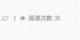
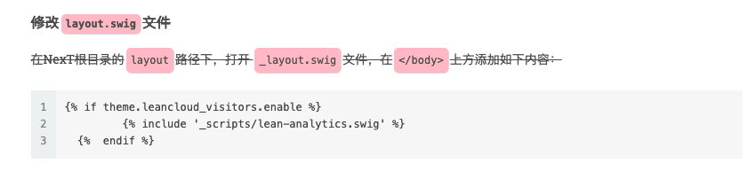

## 阅读次数的统计
我参考了[这个文档](https://notes.doublemine.me/2015-10-21-%E4%B8%BANexT%E4%B8%BB%E9%A2%98%E6%B7%BB%E5%8A%A0%E6%96%87%E7%AB%A0%E9%98%85%E8%AF%BB%E9%87%8F%E7%BB%9F%E8%AE%A1%E5%8A%9F%E8%83%BD.html#%E9%85%8D%E7%BD%AELeanCloud)


## 发现问题

如图  


这个地方会有问题 出现了下面
```code
  月底次数：31:31
```
的情况，

通过查找 [lean-cloud]() 出现的地方,原因是
原来是添加了上面文档中的


这一条 跟 主题原来带的include 代码(86行左右)：
```code
  
```
冲突了，
所以还是事先看看有没有这句话，有的话 就不需要做操作了！

bingo！！！

